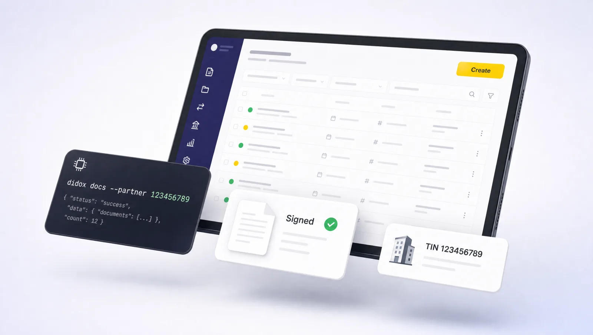

<p align="center">
  
</p>

<h1 align="center">didox-skill</h1>

<p align="center">
  <strong>Didox.uz из терминала — для людей и AI-агентов</strong>
</p>

<p align="center">
  От Word-черновика до подписи ЭЦП: подготовить PDF, подать контрагенту,<br>
  проверить статус, подписать. Без единой зависимости, вывод — JSON.
</p>

<p align="center">
  
  
  <a href="https://skills.sh/smixs/didox-skill"></a>
  
  
</p>

---

Didox — крупнейший оператор электронного документооборота Узбекистана
(350 000+ компаний). Веб-кабинет удобен человеку и мучителен агенту:
формы, датапикеры, модалки. `didox-cli` разговаривает с партнёрским API
напрямую — а приложенный скилл учит любого AI-агента делать это самостоятельно.

## Возможности

- Логин по паролю аккаунта (user-токен кэшируется на 6 часов)
- Список документов с фильтрами: контрагент, тип, статус, входящие/исходящие
- Карточка документа и печатная форма в PDF
- Данные любой компании по ИНН из налоговой базы
- Черновик «Произвольный документ» (000) с PDF-вложением: акты, договоры, приложения
- Черновик любого из 14 типов документов (ЭСФ 002, акт 005, договор НК 007, акт сверки 052…) из JSON
- Принятие и отклонение входящих, отмена отправленных — с подписью E-IMZO
- Статус НДС и реквизиты любой компании из налоговой базы
- Удаление и обновление черновиков
- `raw` — прямой вызов любого эндпоинта API

Подписание — через локальный E-IMZO: пароль ключа вводится в окне самого
E-IMZO и никогда не проходит через CLI. Отправка подписи требует явного
флага `--submit` — случайно подписать нельзя.

## Установка

Через [skills.sh](https://skills.sh/smixs/didox-skill) — ставится в любой из 70+ поддерживаемых агентов (Claude Code, Cursor, Codex, Windsurf, Gemini CLI…):

```bash
npx skills add smixs/didox-skill        # спросит, куда ставить
npx skills add smixs/didox-skill -g     # глобально, для всех проектов
npx skills update didox                 # обновить
```

Claude Code — как плагин:

```bash
claude plugin marketplace add smixs/didox-skill && claude plugin install didox@didox
```

OpenAI Codex CLI:

```bash
npx skills add smixs/didox-skill --agent codex
```

Вручную:

```bash
git clone https://github.com/smixs/didox-skill.git
cp -r didox-skill/skills/didox ~/.claude/skills/     # или каталог скиллов вашего агента
```

После установки перезапустите сессию агента, чтобы скилл подхватился.

## Быстрый старт

```bash
mkdir -p ~/.didox && cat > ~/.didox/env <<'EOF'
DIDOX_PARTNER_TOKEN=<партнёрский JWT>
DIDOX_TIN=<ИНН вашей компании>
DIDOX_PASSWORD=<пароль аккаунта Didox>
EOF
chmod 600 ~/.didox/env
~/.claude/skills/didox/scripts/didox.py login
```

Партнёрский токен выдаёт аккаунт-менеджер Didox ([t.me/Didox_account](https://t.me/Didox_account)).
Пароль аккаунта задаётся в кабинете didox.uz → Профиль → Аккаунт (вход по ЭЦП
пароля не создаёт — задайте его один раз). Тестовый стенд: `DIDOX_URL=https://testapi3.didox.uz`.

## Команды

| Команда | Что делает |
|---|---|
| `didox.py login` | получить и закэшировать user-токен |
| `didox.py profile` | реквизиты своей компании |
| `didox.py docs --partner <ИНН>` | документы по контрагенту |
| `didox.py docs --status 0` | черновики |
| `didox.py docs --owner 0` | входящие |
| `didox.py doc <DOC_ID>` | карточка документа |
| `didox.py doc-pdf <DOC_ID> out.pdf` | печатная форма |
| `didox.py partner <ИНН>` | компания из налоговой базы |
| `didox.py draft-000 …` | черновик с PDF (пример ниже) |
| `didox.py draft-delete <DOC_ID>` | удалить черновик |
| `didox.py sign <DOC_ID> --serial <ЭЦП> [--submit]` | подписать исходящий через локальный E-IMZO |
| `didox.py accept / reject / cancel <DOC_ID> …` | принять, отклонить входящий; отменить отправленный |
| `didox.py create <doctype> payload.json` | черновик любого типа (структуры — в референсах скилла) |
| `didox.py raw GET '/v2/documents?limit=5'` | любой эндпоинт |

Подать акт контрагенту:

```bash
didox.py draft-000 \
  --number 1 --date 2026-08-21 \
  --buyer-tin 123456789 --subtype 5 \
  --name "Акт № 1 к Договору № 42 от 19.06.2026" \
  --contract-no 42 --contract-date 2026-06-19 \
  --pdf act.pdf
```

Подтипы: `2` Письмо · `3` Договор · `5` Акт выполненных работ · `6` Другое ·
`8` Спецификация · `9` Доп. соглашение.
Статусы: `0` черновик · `1` ждёт подписи партнёра · `3` подписан обеими · `4` отказ.

## Скилл для AI-агентов

Папка [`skills/didox/`](skills/didox/) — готовый agent skill в открытом формате
SKILL.md: маршруты («подать акт», «проверить подпись»), pre-flight,
справочники API и сам CLI. Работает с любым агентом, понимающим этот формат —
положите папку в каталог скиллов вашего агента:

```bash
npx skills add smixs/didox-skill   # см. раздел «Установка»
```

После этого «выстави акт контрагенту по подписанному договору» — задача одного
сообщения: агент найдёт договор, создаст черновик, проверит реквизиты и
позовёт вас подписать.

## English

Universal agent skill (with a bundled CLI) for **Didox.uz**, Uzbekistan's
largest e-document exchange (EDO) operator. Python 3.8+, zero dependencies,
JSON output — installs into 70+ agents:

```bash
npx skills add smixs/didox-skill
```

Turn a Word draft into a clean PDF, file it to a counterparty, list documents,
check signing status, look up any company by TIN from the tax registry,
download print forms, and sign with the local E-IMZO key. The key password is
typed into the E-IMZO window and never passes through the CLI; sending a
signature requires an explicit `--submit` flag. Config lives in `~/.didox/env`
(partner token, TIN, account password) — see Quick Start.

## Oʼzbekcha

**didox-skill** — Didox.uz (elektron hujjat almashinuvi) bilan terminal orqali
ishlash uchun CLI va AI-agentlar uchun tayyor skill. Bitta Python-fayl,
qoʼshimcha kutubxonalarsiz, natijalar JSON koʼrinishida.

Oʼrnatish (70 dan ortiq agent qoʼllab-quvvatlanadi):

```bash
npx skills add smixs/didox-skill
```

Imkoniyatlari:

- Word hujjatini toza PDF holatiga keltirish va kontragentga yuborish
- Hujjatlar roʼyxati va imzo holatini tekshirish
- STIR boʼyicha istalgan kompaniya maʼlumotlarini soliq bazasidan olish
- PDF ilova bilan qoralama hujjat yaratish: akt, shartnoma, ilova
- Chop etish shaklini PDF koʼrinishida yuklab olish
- Hujjatni kompyuterdagi E-IMZO kaliti bilan imzolash

Kalit paroli faqat E-IMZO oynasiga kiritiladi va CLI orqali oʼtmaydi. Imzoni
yuborish uchun `--submit` bayrogʼi alohida koʼrsatiladi. Sozlamalar
`~/.didox/env` faylida saqlanadi — Quick Start boʼlimiga qarang.

## См. также

[snjrusmn/didox-mcp](https://github.com/snjrusmn/didox-mcp) — неофициальный
MCP-сервер для Didox (Python, read-only + черновики): если вам нужен именно
MCP-протокол, а не CLI и скилл. Подписи E-IMZO там нет.

## License

MIT
